# Thiết kế hệ thống — PetSpa & Hotel

**Phiên bản:** 2.0, 03/11/2026. **Trạng thái:** APPROVED / BASELINE LOCKED — nhóm trưởng đã duyệt gói sáu tài liệu M2 (M2-15). Phê duyệt tài liệu không phải bằng chứng source/DDL/migration đã triển khai.
**Baseline:** [SRS v3.0](../requirements/SRS_He_Thong_Quan_Ly_Spa_Thu_Cung_AI_Readable.md), [M2-01–M2-15 đã duyệt](../requirements/scope-and-decisions.md#m2-decisions). Quy tắc nghiệp vụ và thiết kế kỹ thuật trong gói sáu tài liệu đã được duyệt theo M2-15. Tài liệu này thay thiết kế v1.0; không giữ hai bộ quy tắc cùng hiệu lực.

## 1. Kiến trúc tổng thể

Pragmatic Modular Monolith ba tầng: trình bày Vue 3; nghiệp vụ .NET 10; dữ liệu Neon PostgreSQL. Giữ PetSpa.Core (entities, DTO, enum, interface), PetSpa.Api (controllers, services, DbContext, integration), PetSpa.Tests. Không thêm CQRS, MediatR, broker, microservices hoặc project Application/Infrastructure.

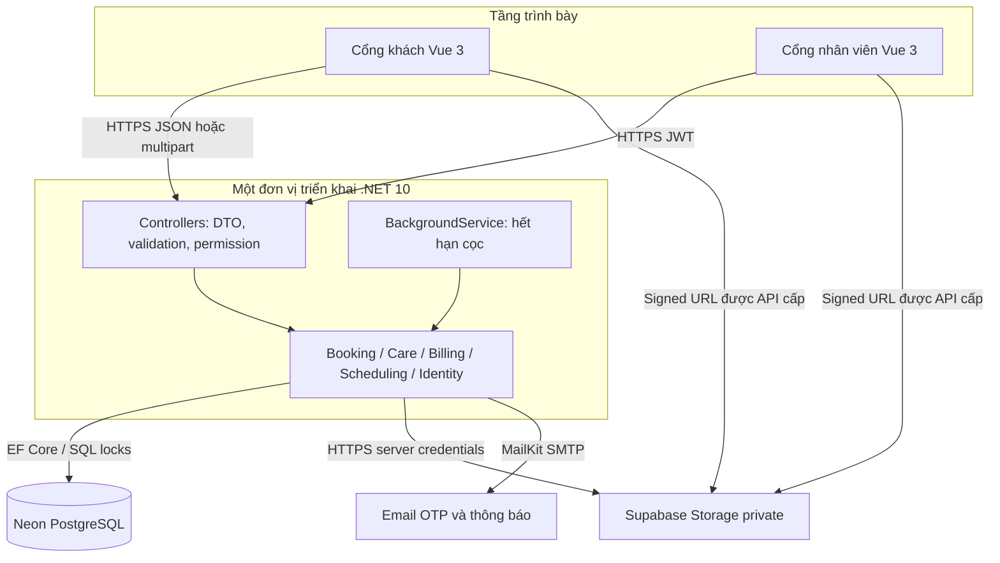
```mermaid
flowchart TB
    subgraph Browser["Tầng trình bày"]
        Guest["Cổng khách Vue 3"]
        Staff["Cổng nhân viên Vue 3"]
    end
    subgraph Server["Một đơn vị triển khai .NET 10"]
        API["Controllers: DTO, validation, permission"]
        Modules["Booking / Care / Billing / Scheduling / Identity"]
        Expiry["BackgroundService: hết hạn cọc"]
        API --> Modules
        Expiry --> Modules
    end
    Guest -->|HTTPS JSON hoặc multipart| API
    Staff -->|HTTPS JWT| API
    Modules -->|EF Core / SQL locks| DB[("Neon PostgreSQL")]
    Modules -->|HTTPS server credentials| Storage["Supabase Storage private"]
    Modules -->|MailKit SMTP| Mail["Email OTP và thông báo"]
    Guest -->|Signed URL được API cấp| Storage
    Staff -->|Signed URL được API cấp| Storage
```

Browser không kết nối DB/SMTP hoặc nhận service-role key. Runtime Neon pooler 6543; migration direct 5432; secrets lấy từ cấu hình ngoài Git. VietQR là hướng dẫn chuyển khoản; không webhook xác nhận cọc/thu tiền. SMTP/Storage nằm ngoài SQL transaction.

| Sự cố | Biên giới và cách phục hồi |
|---|---|
| DB/validation trước commit | Rollback header, children và delta tài nguyên; không thành công một phần. |
| SMTP OTP lỗi | Chưa xác minh, chưa giữ tài nguyên; trả lỗi retry có giới hạn. |
| SMTP sau commit lỗi | Booking/review/giao dịch vẫn tồn tại; trả cảnh báo, gửi lại riêng, không tạo booking mới. |
| Storage lỗi | Giữ trạng thái cũ; file upload trước commit không tham chiếu vẫn private, dọn có kiểm soát. |
| Tác vụ hết hạn dừng | Deadline vẫn được writer kiểm tra dưới khóa; worker quét lại idempotent khi hoạt động. |
| Tiền ngân hàng đã chuyển | Không rollback được; ghi khoản thực nhận và nghĩa vụ hoàn theo chính sách. |

Các module cùng tiến trình nên không cách ly process crash. Đề xuất worker quét mỗi 30 giây; reservation logic hết hiệu lực đúng deadline, không cộng thêm 30 giây. Writer xử lý đơn quá hạn bằng transaction riêng theo protocol trước khi chiếm tài nguyên, không khóa ca rồi quay lại khóa booking khác.

## 2. Module, ownership và chia việc

| Module | Dữ liệu sở hữu | Trách nhiệm và interface với module khác |
|---|---|---|
| Booking | khach_hang, thu_cung, don_dat_lich, chi_tiet_don | Tạo/duyệt/dời/hủy, tracking; điều phối aggregate pet. Care thay tiến độ qua service sở hữu lifecycle, không sửa state tùy ý. |
| Care | ho_so_tiem_chung, nhat_ky_cham_soc, danh_gia | Tiếp nhận, assignment, care, bàn giao; gọi giá/permission/ca, cùng transaction use case. |
| Billing | Catalog/giá, dich_vu_trong_don/thành phần, phu_phi, hoa_don/ct_hoa_don, tien_coc/giao_dich_thu/hoan_coc | Snapshot, thu/hoàn; không tự đổi pet DONE khi PAID. |
| Scheduling | ca_lam_viec, khung_gio_dat_lich, dang_ky_ca, ngay_nghi, dot_dang_ky_ca, cau_hinh_he_thong | Công suất, đợt đăng ký, ngày nghỉ; cung cấp kiểm tra/khóa tài nguyên. |
| Identity | nhan_vien, quyen, nhan_vien_quyen, otp_challenge, bao_ve_tracking, audit_log | Auth và permission; OTP khách không tạo account khách. |

Controller -> service use case -> DbContext/integration. Một DbContext transaction cho use case xuyên module; không gọi HTTP nội bộ giữa module. Các module ghi audit qua interface trong cùng transaction.

Gợi ý ba thành viên: Booking/Tracking; Care/Scheduling; Billing/Catalog. Lead phụ trách Identity và review interface/contract. Đây là đề xuất phân công, không phải chia ba database hoặc ba người cùng sửa entity tùy ý.

## 3. Bảng quyền duy nhất — FR01

Receptionist/Care Tech là template chức năng; role tài khoản ADMIN/STAFF không thay permission. Cột dưới là mặc định. Guest chỉ dùng Public flow đã xác minh, không phải role tài khoản.

| Permission | Guest | Lễ tân | Spa | Admin |
|---|---|---|---|---|
| CATALOG_VIEW | Có | Có | Có | Có |
| BOOKING_CREATE | Có | Có | Không | Có |
| TRACKING_VIEW | Cặp xác minh | Có | Không | Có |
| CUSTOMER_LOOKUP | Không | Có | Không | Có |
| BOOKING_APPROVE | Không | Có | Không | Có |
| BOOKING_RESCHEDULE | Không | Không | Không | Có |
| CHECKIN_PERFORM | Không | Có | Không | Có |
| CARE_UPDATE | Không | Không | Có | Có |
| PHOTO_UPLOAD | Không | Không | Có | Có |
| PET_HANDOVER | Không | Có | Không | Có |
| INVOICE_CREATE | Không | Có | Không | Có |
| INVOICE_COLLECT | Không | Có | Không | Có |
| INVOICE_REVOKE | Không | Không | Không | Có |
| PET_CANCEL_LINE | Không | Không | Không | Có |
| SCHEDULE_REGISTER | Không | Có | Có | Có |
| SCHEDULE_APPROVE | Không | Không | Không | Có |
| SYSTEM_CONFIG | Không | Không | Không | Có |
| EARLY_HANDOVER_APPROVE | Không | Không | Không | Có |
| DEPOSIT_CONFIRM | Không | Có | Không | Có |
| DEPOSIT_REFUND | Không | Không | Không | Có |
| TRACKING_UNLOCK | Không | Không | Không | Có |
| PERMISSION_MANAGE | Không | Không | Không | Có |
| PHOTO_EXCEPTION_APPROVE | Không | Không | Không | Có |
| REVIEW_READ | Không | Không | Không | Có |

Các mã ngoài FR01 là tên kỹ thuật đề xuất cho hành động đã có yêu cầu. Có thể cấp BOOKING_RESCHEDULE/INVOICE_REVOKE cho lễ tân, PET_HANDOVER cho Spa theo FR01; không tự cấp quyền Admin-only cho template khác. CARE_UPDATE/PHOTO_UPLOAD cần assignment hiện tại và ca APPROVED; Admin override actor không bỏ guard trạng thái, tiền hoặc ảnh. CHECKIN_PERFORM bao gồm ảnh tiếp nhận, không cần cấp PHOTO_UPLOAD chăm sóc cho lễ tân.

Mọi request kiểm tra server; quyền đã thu hồi phải có hiệu lực request tiếp theo, không chỉ chờ JWT hết hạn. Không cất toàn bộ permission có hiệu lực lâu trong JWT nếu không có kiểm tra phiên bản/quyền hiện tại. Giữ >=1 Admin hoạt động. Thay quyền, override, nhận sớm, miễn ảnh, hủy riêng và miễn phí phải ghi audit.

## 4. Mô hình M2 sửa theo review L1–L5

**Phạm vi:** mục 4.2–4.3 là hai sơ đồ con cho hồ sơ, đơn, hóa đơn và tiền; bảng phụ thuộc/actor ở 4.4. Mục 4.11 là ERD tổng thể 33 bảng; không dùng riêng một sơ đồ con để sinh schema.

**Nguồn quyết định:** [bổ sung M2 đã duyệt](../requirements/scope-and-decisions.md#m2-decisions). Chi tiết FK/cột/status dưới đây thuộc baseline kỹ thuật đã duyệt, không phải migration đã chạy.

### 4.1 Ngữ nghĩa, tên bảng và vòng đời bản nháp

- `thu_cung` là hồ sơ pet dùng lại; `chi_tiet_don` là một pet tham gia một booking, FK tới cả `thu_cung` và `don_dat_lich`, UNIQUE(đơn,pet). Dữ liệu snapshot của lượt phục vụ tồn tại cùng FK, không thay thế hồ sơ gốc.
- `dich_vu_trong_don` lưu từng dịch vụ Spa/Combo của pet, gồm cả đặt ban đầu và phát sinh. Bảng này thay thiết kế `dich_vu_phat_sinh` ở v1.0; không giữ hai bảng cùng trách nhiệm. Tách `thanh_phan_dich_vu_trong_don` để chứng minh phần combo đã thực hiện khi hủy dở.
- Hotel được giữ tại `chi_tiet_don`: loại phòng, khoảng lưu trú liên quan, giá phòng cam kết/chốt và số đêm. Không tạo bảng Hotel chỉ để có thêm hình. Vì vậy một pet có thể có 0 dòng Spa nhưng phải có Hotel hợp lệ; không cho pet vừa không Spa vừa không Hotel.
- Booking chỉ được tạo thành công khi có ít nhất một pet hợp lệ. Form chưa chọn pet là dữ liệu đang nhập, không phải booking DB; chưa có nghiệp vụ booking DRAFT.
- `UNPAID` là hóa đơn đã lập đầy đủ snapshot, không phải header rỗng đang soạn. Header và ít nhất một dòng hợp lệ commit cùng transaction; không tạo dòng giả. ERD 1..N là bất biến nghiệp vụ, FK thông thường chưa đủ để bảo đảm header có con; service kiểm tra trước commit.
- `ct` là viết tắt của “chi tiết”; giữ tên `ct_hoa_don` theo SRS, tên hiển thị báo cáo là “Chi tiết hóa đơn”. Nhãn quan hệ đọc từ trái sang phải; quy tắc snapshot được mô tả bằng văn bản, không dùng thay nhãn quan hệ.

### 4.2 Hồ sơ và nguồn dữ liệu dùng lại

Sơ đồ này thể hiện nguồn danh mục và hồ sơ. Phụ thuộc bảng ca/nhân viên ở 4.4. Chính sách và giá đã cam kết phải snapshot, không tính lại lịch sử từ danh mục hiện tại.

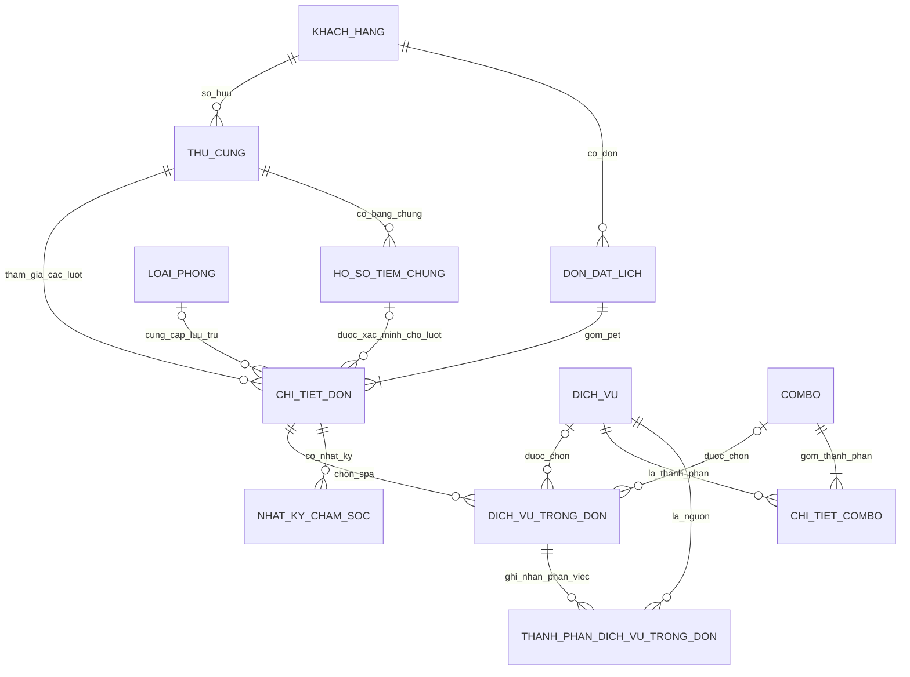
```mermaid
erDiagram
    KHACH_HANG ||--o{ THU_CUNG : so_huu
    KHACH_HANG ||--o{ DON_DAT_LICH : co_don
    THU_CUNG ||--o{ CHI_TIET_DON : tham_gia_cac_luot
    DON_DAT_LICH ||--|{ CHI_TIET_DON : gom_pet
    CHI_TIET_DON ||--o{ DICH_VU_TRONG_DON : chon_spa
    DICH_VU o|--o{ DICH_VU_TRONG_DON : duoc_chon
    COMBO o|--o{ DICH_VU_TRONG_DON : duoc_chon
    COMBO ||--|{ CHI_TIET_COMBO : gom_thanh_phan
    DICH_VU ||--o{ CHI_TIET_COMBO : la_thanh_phan
    DICH_VU_TRONG_DON ||--o{ THANH_PHAN_DICH_VU_TRONG_DON : ghi_nhan_phan_viec
    DICH_VU ||--o{ THANH_PHAN_DICH_VU_TRONG_DON : la_nguon
    LOAI_PHONG o|--o{ CHI_TIET_DON : cung_cap_luu_tru
    THU_CUNG ||--o{ HO_SO_TIEM_CHUNG : co_bang_chung
    HO_SO_TIEM_CHUNG o|--o{ CHI_TIET_DON : duoc_xac_minh_cho_luot
    CHI_TIET_DON ||--o{ NHAT_KY_CHAM_SOC : co_nhat_ky
```

Mỗi dòng `dich_vu_trong_don` có đúng một FK `dich_vu_id` hoặc `combo_id` (XOR). Cardinality từng cạnh optional không tự thể hiện được XOR; cần CHECK row tương ứng. Pet có nhiều dịch vụ không được nhân số lần chăm sóc/bàn giao hoặc suất phòng.

### 4.3 Đơn, hóa đơn và tiền

**Đây là sơ đồ con đơn–hóa đơn–tiền.** Nó phụ thuộc `khach_hang`, `thu_cung`, `dich_vu`, `combo`, `loai_phong`, `nhan_vien`, `khung_gio_dat_lich`, `ca_lam_viec`, `dang_ky_ca`, giá theo size và các bảng quyền/cấu hình. Nguồn pet/catalog xem 4.2; nguồn ca/actor xem 4.4.

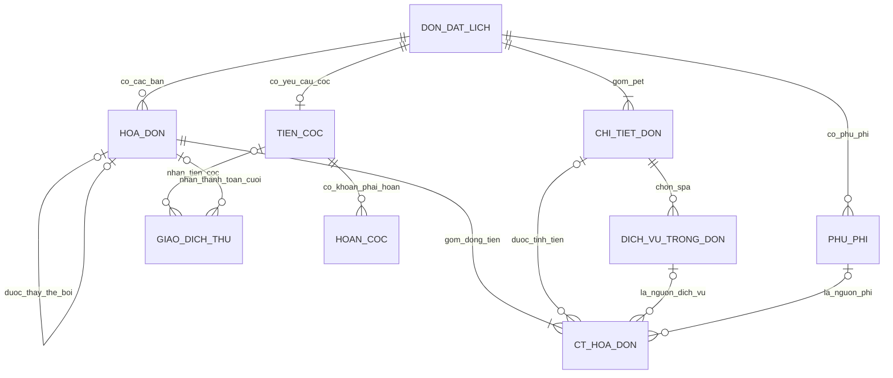
```mermaid
erDiagram
    DON_DAT_LICH ||--|{ CHI_TIET_DON : gom_pet
    CHI_TIET_DON ||--o{ DICH_VU_TRONG_DON : chon_spa
    DON_DAT_LICH ||--o{ HOA_DON : co_cac_ban
    HOA_DON o|--o| HOA_DON : duoc_thay_the_boi
    HOA_DON ||--|{ CT_HOA_DON : gom_dong_tien
    CHI_TIET_DON o|--o{ CT_HOA_DON : duoc_tinh_tien
    DICH_VU_TRONG_DON o|--o{ CT_HOA_DON : la_nguon_dich_vu
    PHU_PHI o|--o{ CT_HOA_DON : la_nguon_phi
    DON_DAT_LICH ||--o{ PHU_PHI : co_phu_phi
    DON_DAT_LICH ||--o| TIEN_COC : co_yeu_cau_coc
    TIEN_COC o|--o{ GIAO_DICH_THU : nhan_tien_coc
    HOA_DON o|--o{ GIAO_DICH_THU : nhan_thanh_toan_cuoi
    TIEN_COC ||--o{ HOAN_COC : co_khoan_phai_hoan
```

- Mỗi `giao_dich_thu` có đúng một đích cọc hoặc hóa đơn (XOR); không ghi cùng tiền vào cả hai. `hoa_don.coc_khau_tru` là phân bổ tiền đã nhận, không phải giao dịch nhận thêm tiền.
- Hóa đơn mới tham chiếu bản bị thay thế qua `thay_the_hoa_don_id`; cùng booking, bản cũ phải REVOKED, mã mới khác, tối đa một bản thay thế trực tiếp, không chu trình. UNIQUE một hóa đơn hiệu lực/đơn; nhiều bản REVOKED là lịch sử, không phải nhiều hóa đơn thu tiền song song.
- `ct_hoa_don.chi_tiet_don_id` là ngữ cảnh pet. FK nguồn khoản thu là dịch vụ trong đơn, lượt Hotel hoặc phụ phí. Không áp “chỉ một FK nguồn” theo cách cấm đồng thời pet và dịch vụ, vì như vậy không thể chứng minh dòng dịch vụ thuộc pet nào.
- Dòng Spa cần pet + dịch vụ nguồn; dòng Hotel cần pet có loại phòng; phí riêng pet cần pet + phụ phí; phí chung đơn được NULL pet, có nhãn “Phí chung đơn”. Tất cả nguồn phải thuộc cùng booking với hóa đơn.

### 4.4 FK ngoài sơ đồ và actor

| Dữ liệu | FK/ý nghĩa | Nullability và kiểm tra |
|---|---|---|
| don_dat_lich.khach_hang_id | -> khach_hang | Bắt buộc; thông tin người đặt snapshot riêng. |
| chi_tiet_don.thu_cung_id | -> thu_cung | Bắt buộc; pet thuộc đúng hồ sơ đã được xác minh. |
| don_dat_lich.khung_gio_id | -> khung_gio_dat_lich -> ca_lam_viec | Bắt buộc cho lịch tiếp nhận, không đồng nghĩa Hotel-only giữ suất Spa. |
| dich_vu_trong_don.khung_gio_id | -> khung_gio_dat_lich | Bắt buộc; dịch vụ thêm có ca thực hiện riêng. |
| chi_tiet_don.loai_phong_id | -> loai_phong | NULL khi chỉ Spa, bắt buộc khi có Hotel. |
| don_dat_lich.tao_boi_id | -> nhan_vien | Public NULL; nội bộ lấy actor hiện tại, không tin body. |
| don_dat_lich.duyet_boi_id | -> nhan_vien | NULL trước duyệt, bắt buộc khi đã duyệt; có duyet_at. |
| chi_tiet_don.nhan_vien_id | -> nhan_vien | Có thể NULL trước assignment; thao tác care cần assignment và ca APPROVED. |
| chi_tiet_don.check_in_boi_id/ban_giao_boi_id | -> nhan_vien | NULL trước hành động; bắt buộc cùng timestamp sau hành động. |
| nhat_ky_cham_soc.nhan_vien_id | -> nhan_vien | Bắt buộc, tác giả bất biến khi đổi assignment. |
| hoa_don.tao_boi_id/thu_boi_id/thu_hoi_boi_id | -> nhan_vien | Người lập bắt buộc; thu/thu hồi bắt buộc đúng transition. |
| giao_dich_thu.xac_nhan_boi_id | -> nhan_vien | Bắt buộc khi tiền đã được ghi nhận; lưu thời điểm đối soát. |
| hoan_coc.tao_boi_id/hoan_boi_id | -> nhan_vien | Người tạo bắt buộc; người thực hoàn NULL khi CHO_HOAN. |

Role/permission kiểm tra server theo FR01. Assignment FK đơn thuần không chứng minh người đó có ca APPROVED; kiểm tra dưới transaction. Không dùng một cột nhân viên chung để thay người tạo, duyệt, chăm sóc và thu tiền.

### 4.5 Nhóm bảng gốc và nhóm bổ sung

**Nhóm A — 19 bảng gốc để đối chiếu:** khach_hang, thu_cung, ho_so_tiem_chung, dich_vu, combo, chi_tiet_combo, he_so_can_nang, loai_phong, ca_lam_viec, khung_gio_dat_lich, don_dat_lich, chi_tiet_don, nhat_ky_cham_soc, hoa_don, ct_hoa_don, phu_phi, nhan_vien, dang_ky_ca, danh_gia. Giữ nhóm không có nghĩa giữ nguyên toàn bộ cột/constraints v1.

**Nhóm B — bảng bổ sung đang đề xuất**, trình riêng trong báo cáo:

| Bảng | Lý do bổ sung |
|---|---|
| bang_gia_size | Giá Spa/Combo theo size; nguồn snapshot giá cam kết. |
| dich_vu_trong_don | Nhiều dịch vụ/pet, hợp nhất ban đầu và phát sinh. |
| thanh_phan_dich_vu_trong_don | Snapshot phần việc combo và giá lẻ để tính hủy dở. |
| tien_coc | Một yêu cầu cọc và deadline/số tiền snapshot. |
| giao_dich_thu | Nhiều khoản thực nhận có đối soát, không mất lịch sử tiền. |
| hoan_coc | Theo dõi nghĩa vụ hoàn và việc thực hoàn. |
| quyen | Danh mục permission thống nhất FR01. |
| nhan_vien_quyen | Quyền hiệu lực của từng nhân viên. |
| otp_challenge | OTP có scope, TTL và số lần thử. |
| bao_ve_tracking | Bộ đếm sai, khóa và mở khóa tra cứu. |
| cau_hinh_he_thong | Extension/chính sách có phiên bản, snapshot phần áp dụng vào đơn. |
| ngay_nghi | Đóng nhận/trả mới, không đóng chăm sóc Hotel đang lưu trú. |
| dot_dang_ky_ca | Đợt và hạn đăng ký theo UC41. |
| audit_log | Dấu vết thao tác nhạy cảm; không lưu secrets/OTP/cặp tracking. |

33 là tổng số bảng trong baseline đã duyệt; dictionary phần còn lại ở 4.10. Không tạo bảng không có nghiệp vụ chỉ để đủ số.

### 4.6 Dictionary phần thay đổi quan trọng

Quy ước: id integer identity PK; FK integer cùng kiểu; tiền numeric(14,0), cân numeric(5,2), số đêm/số lượng integer, thời điểm timestamptz, ngày date, mã varchar(40), tên varchar(150), ghi chú text. Dấu ? là NULL; không có ? là NOT NULL. Các bảng nghiệp vụ có created_at; bảng có thay đổi có updated_at. Quy ước FK không thay thế kiểm tra cùng booking.

**Ánh xạ M3 theo yêu cầu triển khai ngày 03/11/2026:** `chi_tiet_combo` dùng PK kép `(combo_id, dich_vu_id)`, không thêm id identity; `nhan_vien_quyen` dùng PK kép và `quyen` dùng PK chuỗi như đã chốt. `chi_tiet_don` lưu thêm `can_nang_khai_bao numeric(5,2) NOT NULL` từ payload đặt lịch và `ready_at timestamptz NULL` khi sẵn sàng để bảo toàn dữ liệu từng lượt. Đây là ánh xạ dữ liệu cho contract hiện có, không thêm endpoint hoặc thay quy tắc tính tiền. `created_at`/`updated_at` có giá trị mặc định lúc INSERT; cập nhật timestamp, JSON validation và các invariant liên bảng thuộc tầng service sau này, không được hiểu là đã có chỉ nhờ Fluent API.

| Bảng | Cột và kiểu nghiệp vụ | Bất biến |
|---|---|---|
| dich_vu_trong_don | id; chi_tiet_don_id; dich_vu_id?; combo_id?; khung_gio_id; request_id uuid; la_phat_sinh boolean; ten_snapshot; bang_gia_size_snapshot jsonb; thoi_luong_snapshot integer; trang_thai; size_chot?; gia_chot? numeric(14,0); ly_do?; hoan_tat_at?/huy_at? | XOR nguồn; request_id unique; snapshot bốn giá cam kết lúc đặt; dịch vụ phát sinh snapshot giá khi xác nhận thêm. Thời lượng >0; giá chốt >=0. |
| thanh_phan_dich_vu_trong_don | id; dich_vu_trong_don_id; dich_vu_id; ten_snapshot; gia_le_size_snapshot jsonb; thoi_luong_snapshot integer; trang_thai; hoan_tat_at? | UNIQUE(dịch vụ trong đơn,dịch vụ thành phần); không thu đồng thời cả combo và giá lẻ thành phần. |
| chi_tiet_don — thay cột v1 | thu_cung_id; ten_pet_snapshot; trang_thai_cham_soc; can_nang_chot?; size_thuc_te?/size_chot?; thoa_thuan_gia?; loai_phong_id?; gia_phong_cam_ket?/gia_phong_chot? numeric(14,0); so_dem_chot?; check_in_at?/ban_giao_at?/tra_lai_at?; nhan_som boolean | Bỏ dich_vu_id/combo_id trực tiếp; mặc định NOT_ARRIVED; giá/cân chốt NULL trước tiếp nhận. tra_lai_at dành pet CANCELLED, không đổi giả thành DONE. |
| hoa_don — bổ sung | ma_hoa_don; thay_the_hoa_don_id?; trang_thai; tong_tien/coc_khau_tru/con_phai_tra numeric(14,0); khach_snapshot jsonb | Mã unique; UNIQUE bản bị thay thế khi có; một hiệu lực/đơn khi trạng thái !=REVOKED. PAID/REVOKED không sửa snapshot. |
| ct_hoa_don — thay cột v1 | hoa_don_id; chi_tiet_don_id?; dich_vu_trong_don_id?; phu_phi_id?; loai_khoan; ten_pet_snapshot?; ten_khoan_muc; size_snapshot?; so_luong; don_gia_snapshot/thanh_tien numeric(14,0); dien_giai? | >=1 dòng hợp lệ/invoice; số lượng >0; nguồn và pet cùng booking; dòng Hotel N đêm, Spa không tính lại giá danh mục. |
| tien_coc | id; don_dat_lich_id; co_so_tinh_snapshot numeric(14,0); ty_le numeric(4,2); so_tien_yeu_cau numeric(14,0); het_han_at; trang_thai_yeu_cau; ket_thuc_at? | UNIQUE đơn; tỷ lệ 0.30; không ghi đè cơ sở/deadline để phát hành lại; hủy không xóa. |
| giao_dich_thu | id; tien_coc_id?; hoa_don_id?; request_id uuid; so_tien numeric(14,0); phuong_thuc; ngan_hang?; ma_giao_dich?; giao_dich_at; xac_nhan_at; xac_nhan_boi_id; ghi_chu? | XOR đích; số tiền >0; request_id unique; chống trùng mã ngân hàng trong scope ngân hàng; tiền nhận sau hết hạn vẫn ghi nhận để hoàn. |
| hoan_coc | id; tien_coc_id; request_id uuid; so_tien numeric(14,0); ly_do; trang_thai; tao_boi_id; hoan_boi_id?; hoan_at?; phuong_thuc?; tham_chieu?; bang_chung_path? | >0; request_id unique; chỉ xác nhận DA_HOAN sau thực trả; bằng chứng private; tổng khoản dành hoàn không vượt tiền còn được hoàn. |

### 4.7 Lifecycle cọc và bảo toàn tiền

Tách ba chiều, không dùng một enum thay tất cả:

| Dữ liệu | Mã đề xuất | Ý nghĩa |
|---|---|---|
| tien_coc.trang_thai_yeu_cau | CHO_THU / DA_DAP_UNG / HET_HAN / HUY | Hiệu lực yêu cầu; DA_DAP_UNG chỉ sau nhân viên xác nhận đủ trước deadline. |
| Projection số thực nhận | CHUA_THU / THU_THIEU / THU_DU / THU_THUA | Tính từ giao_dich_thu so với yêu cầu; không phải invoice PARTIAL_PAID. |
| hoan_coc.trang_thai | CHO_HOAN / DA_HOAN | Khoản phải hoàn và kết quả thực hoàn; DA_HOAN không xóa việc đã thu trước đó. |

CHO_THU ->DA_DAP_UNG khi xác nhận đủ dưới khóa trước hạn; CHO_THU ->HET_HAN khi hết 30 phút; CHO_THU ->HUY khi đơn bị hủy trước đó. Không có transition hồi sinh HET_HAN/HUY. Yêu cầu đã đáp ứng vẫn giữ lịch sử đó khi đơn bị hủy và phát sinh hoàn; vòng đời hoàn độc lập.

Projection tính từ tiền đã được nhân viên đối soát, không từ khách bấm “đã chuyển”. Thiếu cọc không kéo dài deadline. Thừa cọc phải ghi nhận xử lý phần dư; không tự tăng khoản khấu trừ. Tiền đến muộn sau HET_HAN/HUY không được chuyển yêu cầu sang DA_DAP_UNG, không lấy lại chỗ.

Cơ sở cọc = tổng phòng + mọi Spa/Combo đặt ban đầu toàn đơn; cọc = 0.30 × cơ sở đó, snapshot lúc đặt. Đề xuất làm tròn half-up đến 1 VND, cần thống nhất contract. Không tính lại cọc khi check-in đổi size. Cọc dư sau hủy riêng được hoàn chênh lệch; phạt giữ cọc của hủy toàn đơn muộn/no-show không tự áp cho hủy riêng.

Khóa booking -> tài nguyên bị ảnh hưởng -> cọc/invoice theo thứ tự nhất quán trước đối soát, phân bổ hoặc tạo khoản hoàn. Tổng cọc khấu trừ ở invoice hiệu lực + tiền giữ cọc hợp lệ + khoản dành hoàn (gồm cả CHO_HOAN) không vượt tổng thực nhận. Không vừa khấu trừ vừa hoàn cùng một phần tiền. Invoice REVOKED không tiếp tục chiếm phân bổ; bản mới dùng lại phần đủ điều kiện dưới khóa, không tạo giao dịch thu giả.

Nếu cần phát hành lại yêu cầu cọc trong tương lai, phải duyệt nghiệp vụ 1:N và ràng buộc tối đa một yêu cầu hiệu lực. Hiện tại chưa thêm chức năng đó hoặc tự thay chính sách cọc của đơn đã snapshot.

### 4.8 Quy tắc xóa, sửa và indexes

| Nhóm | DELETE và điều chỉnh |
|---|---|
| Booking, dòng pet, dịch vụ đã lưu | Không hard-delete bằng API nghiệp vụ; hủy giữ lý do/actor/thời điểm. |
| hoa_don, ct_hoa_don | Không xóa; UNPAID thu hồi thành REVOKED và giữ lines; PAID không cập nhật/xóa. Không cascade từ đơn. |
| tien_coc, giao_dich_thu, hoan_coc | Không xóa lịch sử; hủy yêu cầu không xóa khoản thu; không ghi đè giao dịch đã xác nhận. Điều chỉnh sai sót cần quy trình có audit trước khi mở endpoint, không tự sửa số tiền cũ. |
| Khách/pet/catalog/phòng/nhân viên có tham chiếu | FK ON DELETE RESTRICT; ngừng hoạt động/ẩn phù hợp, không mất lịch sử. |
| Nhật ký/audit/ảnh có tham chiếu | Không cascade theo đơn; kiểm soát quyền đọc và retention riêng. |
| OTP hết hạn/bộ đếm/file tạm không được tham chiếu | Được dọn theo TTL/retention cấu hình; không lan sang dữ liệu nghiệp vụ. |

Tất cả FK tra cứu chính cần index. UNIQUE: booking.request_id, tracking_code, (booking,pet), invoice.ma_hoa_don, invoice.thay_the_hoa_don_id khi có, một invoice hiệu lực/booking, tien_coc.booking_id, request_id của thu/hoàn/dịch vụ. Index thêm: booking(state,khung), dịch vụ(khung,state), nhật ký(pet,thời gian), cọc(state,deadline), invoice(paid_at).

FK row không đủ kiểm tra nguồn cùng booking, tổng tiền hoặc deadline. Các guard liên bảng thực hiện trong transaction; phần CHECK/UNIQUE nào dùng được phải ghi rõ khi chốt dictionary. Không tuyên bố ERD tự bảo đảm các invariant đó.

### 4.9 Kịch bản review dữ liệu bắt buộc

| Mã | Kịch bản và kết quả mong đợi |
|---|---|
| M2-L01 | Pet Hotel-only: 0 dịch vụ Spa, có phòng và dòng invoice Hotel đúng pet/số đêm; không giữ slot Spa. |
| M2-L02 | Pet không Spa/Hotel hoặc booking không pet: từ chối trước commit; không header mồ côi. |
| M2-L03 | Lập invoice: commit header+lines đầy đủ; lỗi tạo lines rollback; không dòng giả. |
| M2-L04 | Thu hồi rồi tạo lại: mã mới/FK thay thế đúng, giữ lines cũ, không hai invoice hiệu lực hoặc chiếm cọc hai lần. |
| M2-L05 | Nhiều khoản thu cọc: không ghi đè lần đầu; retry/mã ngân hàng trùng không nhân đôi tiền. |
| M2-L06 | Xác nhận cọc đụng hết hạn: một kết quả dưới booking lock; tiền phát hiện muộn được hoàn, không hồi sinh chỗ. |
| M2-L07 | Hủy riêng làm tổng thấp hơn cọc: khoản khấu trừ + hoàn không vượt thực nhận; Tracking phản ánh CHO_HOAN/DA_HOAN. |
| M2-L08 | Xóa đơn/catalog có invoice/thu/hoàn: bị chặn; dữ liệu tiền và snapshot không cascade mất. |
| M2-L09 | Dòng invoice trỏ dịch vụ/pet/phí khác booking: bị chặn; phí chung đơn có nhãn rõ, không giả pet. |

Đây là tiêu chí thiết kế, chưa phải integration tests đã chạy. Xem cửa duyệt mục 9.

### 4.10 Hoàn thiện dictionary các bảng còn lại

Kế thừa kiểu/nullability ở 4.6. Mọi bảng có id PK và created_at/updated_at trừ bảng khóa kép và audit append-only. Cột actor là FK nhan_vien; cột *_id khác trỏ bảng cùng tên theo ERD. JSON snapshot phải validate schema; không được dùng JSON thay quan hệ tiền/ownership. Những cột/cấu trúc sau thuộc baseline kỹ thuật đã duyệt.

| Bảng | Cột nghiệp vụ bắt buộc; cột ? được NULL | Ràng buộc bổ sung |
|---|---|---|
| khach_hang | ho_ten; so_dien_thoai varchar(15); email varchar(254); deleted_at? | SĐT 10 chữ số chuẩn hóa, index không UNIQUE toàn cục vì UC01 cho Admin tách hồ sơ gia đình. Public không tự chọn ngẫu nhiên một master khi mơ hồ. |
| thu_cung | khach_hang_id; ten_thu_cung; loai_pet; can_nang numeric(5,2); giong?; ngay_sinh? date; loai_long?; ghi_chu_di_ung?; deleted_at? | CHO/MEO, cân >0; tên không unique; snapshot lịch sử không đổi theo hồ sơ. |
| ho_so_tiem_chung | thu_cung_id; loai_vaccine; ngay_tiem date; hieu_luc_den? date; object_path? text; co_so_cap?; ghi_chu? | Bằng chứng giấy hoặc ảnh; ngày không ngược; xác minh áp dụng theo lượt riêng, không coi có ảnh là hợp lệ. |
| dich_vu | ten_dich_vu; loai_dich_vu; thoi_luong_phut int; yeu_cau_tiem_chung bool; is_active bool; mo_ta? | Thời lượng >0; cắt tỉa không được mua riêng; giá ở bang_gia_size. |
| combo | ten_combo; is_active bool; mo_ta? | >=1 thành phần, giá combo theo size <= tổng giá lẻ tương ứng; yêu cầu tiêm nếu một thành phần yêu cầu. |
| chi_tiet_combo | combo_id; dich_vu_id | UNIQUE(combo,dịch vụ); FK RESTRICT. |
| he_so_can_nang | ma_size; can_nang_tu numeric(5,2); can_nang_den? numeric(5,2) | Giữ tên bảng đối chiếu; S[0,5), M[5,15), L[15,25), XL[25,+∞). Giá trực tiếp theo size, không nhân hệ số lần nữa; cột he_so cũ bị thay trong đề xuất. |
| loai_phong | ten_phong; gia_moi_dem numeric(14,0); so_luong_phong int; is_active bool | Giá/suất >=0; khóa khi kiểm tra/đổi năng lực. |
| ca_lam_viec | ten_ca; gio_bat_dau/gio_ket_thuc time; suc_chua_pet int; tran_phut int; is_active bool | Ca cùng ngày, đầu<cuối; trần không âm. |
| khung_gio_dat_lich | ca_lam_viec_id; ngay date; mo_nhan_khach bool; tong_slot/slot_da_dat/tran_phut/phut_da_giu int | UNIQUE(ngày,ca); 0<=đã đặt<=tổng; phút không âm; còn lại tính toán. |
| don_dat_lich | khach_hang_id; khung_gio_id; request_id uuid; fingerprint text; tracking_code varchar(8); trang_thai; ten_nguoi_dat; so_dien_thoai_snapshot; email_snapshot; bat_dau_du_kien/ket_thuc_du_kien/moc_cuoi_ca timestamptz; tong_tam_tinh numeric(14,0); chinh_sach_snapshot jsonb; email_delivery?; email_attempt_at?; tao_boi_id?/duyet_boi_id?/huy_boi_id?; duyet_at?/huy_at?/hoan_tat_at?; loai_huy?/ly_do_huy? | UNIQUE request/tracking; Public tao_boi NULL; snapshot ca chống đổi deadline; không booking READY. |
| nhat_ky_cham_soc | chi_tiet_don_id; nhan_vien_id; loai_nhat_ky; ghi_nhan_at; object_path?; ghi_chu?; can_nang_ghi_nhan? | Có ảnh hoặc nội dung, tác giả bất biến; cân theo dõi không ghi đè cân chốt. |
| phu_phi | don_dat_lich_id; ten_phu_phi; so_tien numeric(14,0); ly_do; tao_boi_id; chi_tiet_don_id?; huy_at? | Tiền >0; nguồn cùng booking; không thêm/sửa khi invoice hiệu lực hoặc pet DONE; miễn sau PAID ghi audit. |
| nhan_vien | ten_nhan_vien; ten_dang_nhap; mat_khau_hash text; vai_tro; is_active bool; email? | Username chuẩn hóa unique; ADMIN/STAFF; không secret mặc định. |
| dang_ky_ca | nhan_vien_id; ca_lam_viec_id; dot_id ->dot_dang_ky_ca; ngay date; trang_thai; duyet_boi_id?/duyet_at?; ly_do_dieu_chuyen? | UNIQUE(nhân viên,ngày,ca); PENDING/APPROVED/REJECTED; không chồng giờ; APPROVED là công bố. |
| danh_gia | don_dat_lich_id; khach_hang_id; so_sao int; binh_luan?; chi_tiet_don_id?; dich_vu_trong_don_id?; anh_paths? jsonb | UNIQUE đơn; 1..5 sao; trong 30 ngày từ bàn giao cuối của đơn COMPLETED; nguồn đúng đơn. |
| bang_gia_size | dich_vu_id?; combo_id?; size_id ->he_so_can_nang; don_gia numeric(14,0) | XOR nguồn; unique từng nguồn/size; đủ 4 size trước công bố. |
| quyen | ma_quyen varchar(60) PK; ten_quyen | Không id identity; tên mã khớp mục 3. |
| nhan_vien_quyen | nhan_vien_id; ma_quyen ->quyen; cap_boi_id; cap_at | PK(nhân viên,quyền), không id riêng; thay đổi audit. |
| otp_challenge | request_id uuid; muc_dich; email; so_dien_thoai; otp_digest text; het_han_at/gui_lai_sau; so_lan_sai int; khach_hang_id?; su_dung_at?; proof_digest? text | Scope BOOKING/EXISTING_PETS, không mã/proof rõ; một lần; proof gắn request/contact và scope hồ sơ. |
| bao_ve_tracking | khoa_ip_hash text; khoa_sdt_hash text; so_lan_sai int; bat_dau_cua_so; khoa_den?; mo_boi_id?/mo_at? | UNIQUE hai khóa; không mã tracking, không secret; scope khóa theo cặp IP/SĐT đã chốt trong baseline; kiểm tra chống khóa nhầm ở implementation. |
| cau_hinh_he_thong | khoa varchar(100); gia_tri jsonb; phien_ban int; sua_boi_id | UNIQUE khóa; validate schema, snapshot chính sách không tham chiếu cấu hình live để đổi đơn cũ. |
| ngay_nghi | ngay date; ly_do; tao_boi_id | UNIQUE ngày; không giảm sức chứa Hotel đang ở về 0. |
| dot_dang_ky_ca | tu_ngay/den_ngay date; mo_at/dong_at; tao_boi_id | Đầu<=cuối, mở<đóng; kiểm tra đợt đang mở. |
| audit_log | actor_loai; hanh_dong; loai_doi_tuong; trace_id; actor_id?; doi_tuong_id? int; ly_do?; truoc?/sau? jsonb; request_id? uuid; fingerprint? text; ket_qua? jsonb | UNIQUE(actor/action/request) khi có request; Append-only; không updated_at; không OTP/password/token/tracking pair; không FK đa hình giả tới mọi đối tượng. |

Các cột bổ sung cho chi_tiet_don: tinh_trang_long? (BINH_THUONG/ROI_NHE/ROI_NANG/VE_RAN), ghi_chu_suc_khoe?, ho_so_tiem_chung_id?, xac_minh_tiem_boi_id?/xac_minh_tiem_at?, check_in_boi_id?/ban_giao_boi_id?, huy_boi_id?/huy_at?/ly_do_huy?, so_dem_da_o? int, nhan_som_boi_id?/nhan_som_ly_do?. Các FK actor NULL trước hành động, bắt buộc cùng timestamp sau hành động.

Giấy hợp lệ theo chính sách vận hành: đúng pet, loại vaccine được cấu hình chấp nhận cho dịch vụ, có ngày tiêm và đủ bằng chứng về hiệu lực tại ngày tiếp nhận. Không suy đoán hiệu lực nếu giấy thiếu thông tin: yêu cầu làm rõ trước check-in. Tiệm cung cấp danh sách vaccine/mốc chấp nhận; phần mềm không tự đặt chỉ định y khoa. Lưu tiêu chí snapshot và người xác minh.

### 4.11 ERD tổng thể 33 bảng

Bao gồm cả hai sơ đồ con và các nguồn ca/actor/quyền/cấu hình. Các cạnh optional nguồn phải đọc cùng XOR và guard trong dictionary; không tạo FK đa hình cho audit.

```mermaid
erDiagram
    KHACH_HANG ||--o{ THU_CUNG : so_huu
    KHACH_HANG ||--o{ DON_DAT_LICH : co_don
    THU_CUNG ||--o{ CHI_TIET_DON : tham_gia_cac_luot
    DON_DAT_LICH ||--|{ CHI_TIET_DON : gom_pet
    CHI_TIET_DON ||--o{ DICH_VU_TRONG_DON : chon_spa
    DICH_VU o|--o{ DICH_VU_TRONG_DON : duoc_chon
    COMBO o|--o{ DICH_VU_TRONG_DON : duoc_chon
    COMBO ||--|{ CHI_TIET_COMBO : gom_thanh_phan
    DICH_VU ||--o{ CHI_TIET_COMBO : la_thanh_phan
    DICH_VU_TRONG_DON ||--o{ THANH_PHAN_DICH_VU_TRONG_DON : ghi_nhan_phan_viec
    DICH_VU ||--o{ THANH_PHAN_DICH_VU_TRONG_DON : la_nguon
    LOAI_PHONG o|--o{ CHI_TIET_DON : cung_cap_luu_tru
    THU_CUNG ||--o{ HO_SO_TIEM_CHUNG : co_bang_chung
    HO_SO_TIEM_CHUNG o|--o{ CHI_TIET_DON : duoc_xac_minh_cho_luot
    CHI_TIET_DON ||--o{ NHAT_KY_CHAM_SOC : co_nhat_ky
    DON_DAT_LICH ||--o{ HOA_DON : co_cac_ban
    HOA_DON o|--o| HOA_DON : duoc_thay_the_boi
    HOA_DON ||--|{ CT_HOA_DON : gom_dong_tien
    CHI_TIET_DON o|--o{ CT_HOA_DON : duoc_tinh_tien
    DICH_VU_TRONG_DON o|--o{ CT_HOA_DON : la_nguon_dich_vu
    PHU_PHI o|--o{ CT_HOA_DON : la_nguon_phi
    DON_DAT_LICH ||--o{ PHU_PHI : co_phu_phi
    DON_DAT_LICH ||--o| TIEN_COC : co_yeu_cau_coc
    TIEN_COC o|--o{ GIAO_DICH_THU : nhan_tien_coc
    HOA_DON o|--o{ GIAO_DICH_THU : nhan_thanh_toan_cuoi
    TIEN_COC ||--o{ HOAN_COC : co_khoan_phai_hoan
    NHAN_VIEN o|--o{ DON_DAT_LICH : tao_noi_bo
    NHAN_VIEN o|--o{ DON_DAT_LICH : duyet_don
    NHAN_VIEN o|--o{ CHI_TIET_DON : phu_trach
    NHAN_VIEN ||--o{ NHAT_KY_CHAM_SOC : ghi_nhat_ky
    NHAN_VIEN ||--o{ HOA_DON : lap_hoa_don
    NHAN_VIEN ||--o{ GIAO_DICH_THU : xac_nhan_thu
    NHAN_VIEN o|--o{ HOAN_COC : xac_nhan_hoan
    CA_LAM_VIEC ||--o{ KHUNG_GIO_DAT_LICH : sinh_ca_ngay
    CA_LAM_VIEC ||--o{ DANG_KY_CA : duoc_dang_ky
    NHAN_VIEN ||--o{ DANG_KY_CA : dang_ky
    DOT_DANG_KY_CA ||--o{ DANG_KY_CA : nhan_dang_ky
    NHAN_VIEN ||--o{ NHAN_VIEN_QUYEN : duoc_cap
    QUYEN ||--o{ NHAN_VIEN_QUYEN : duoc_gan
    DICH_VU o|--o{ BANG_GIA_SIZE : co_gia
    COMBO o|--o{ BANG_GIA_SIZE : co_gia
    HE_SO_CAN_NANG ||--o{ BANG_GIA_SIZE : xac_dinh_size
    KHUNG_GIO_DAT_LICH ||--o{ DICH_VU_TRONG_DON : ca_thuc_hien
    KHUNG_GIO_DAT_LICH ||--o{ DON_DAT_LICH : ca_hen
    DON_DAT_LICH ||--o| DANH_GIA : nhan_danh_gia
    KHACH_HANG ||--o{ DANH_GIA : gui_danh_gia
    NHAN_VIEN o|--o{ AUDIT_LOG : thuc_hien
    KHACH_HANG o|--o{ OTP_CHALLENGE : duoc_xac_minh
    NHAN_VIEN ||--o{ NGAY_NGHI : cau_hinh
    NHAN_VIEN ||--o{ CAU_HINH_HE_THONG : thay_doi
    NHAN_VIEN o|--o{ BAO_VE_TRACKING : mo_khoa
```

## 5. Transaction, công suất và giá

Protocol đề xuất READ COMMITTED + SELECT ... FOR UPDATE: booking hiện hữu theo ID -> tập khung ca theo ID -> tập loại phòng theo ID -> tập đăng ký ca theo ID -> cọc/invoice. Mọi writer dùng cùng thứ tự; không khóa slot rồi quay lại hủy booking khác. Tạo mới claim request_id UNIQUE trước giữ tài nguyên, khung ca được upsert sẵn. Cùng key/cùng fingerprint trả bản cũ, khác payload 409; retry không bị chính booking đầu chiếm suất cuối gây hết chỗ giả.

Spa kiểm tra đồng thời số pet DISTINCT(pet-trong-đơn,ca) và tổng phút dịch vụ snapshot. Combo đếm phút thành phần một lần; cùng pet thêm dịch vụ cùng ca không tăng pet nhưng tăng phút. Phút khả dụng=min(trần cấu hình,tổng phút nhân viên APPROVED đủ điều kiện care). Không đếm lễ tân chưa có quyền care như kỹ thuật viên. Giảm nhân sự/trần không được dưới cam kết. Đã làm thì năng lực ca đã tiêu thụ, không trả phút đã dùng để bán lại.

Hotel khóa loại phòng và kiểm tra mỗi đêm [nhận,trả); mỗi pet Hotel một suất, không tăng theo số dịch vụ. Dời lịch loại reservation cũ của chính đơn khi đánh giá lịch mới. Hủy dở nhả phần đêm chưa dùng; pet chưa trả lại thực tế không được coi phòng trống chỉ vì CANCELLED. Overstay phải cảnh báo Admin xử lý xung đột, không tự gia hạn giá hay hứa còn phòng.

Giá: snapshot bốn đơn giá và giá lẻ thành phần khi đặt; check-in chốt cân/size/thỏa thuận theo bảng cam kết; invoice chụp kết quả. Thu gọn giữ size tính giá cũ nhưng lưu cả size thực tế, nội dung thu gọn và xác nhận. Hủy combo dở chỉ tính thành phần đã làm theo giá lẻ snapshot; không cộng thêm giá combo. Hotel tính đêm đã dùng khi hủy dở; trả sớm thông thường không tự đổi giá cam kết. Dịch vụ thêm snapshot giá lúc khách đồng ý thêm, dùng size đã chốt.

| Use case | Transaction và lỗi |
|---|---|
| Dời lịch | Khóa hợp nhất lịch cũ/mới, kiểm tra chưa pet check-in; lỗi rollback giữ lịch cũ. |
| Hủy/check-in cạnh tranh | Cùng booking lock; bên thắng khiến bên sau kiểm tra lại guard; nhả đúng một lần. |
| Cọc/hết hạn | Sau lấy lock đọc giờ server; đủ và trước hạn mới DA_DAP_UNG; nếu quá hạn hủy/nhả rồi ghi tiền muộn để hoàn. |
| Snapshot/thu hồi | Khóa booking/invoice/cọc; tối đa một bản hiệu lực; giữ lịch sử và giải phóng phân bổ của bản REVOKED. |
| Thu tiền | Đủ thực nhận và cọc phân bổ mới PAID; không DONE. |
| Nhận sớm/bàn giao | Khóa booking + pet, tính số pet thực tế còn lại sau thao tác; hai request không thể nhận hết khi chưa PAID. |
| Thay ca/nhân sự | Khóa ca trước registration; kiểm tra reservation và assignment; không âm thầm giảm phút. |

## 6. Bảng trạng thái chung

### 6.1 Đơn DonDatLich

| Mã | Tên tiếng Việt | Chuyển/UC/guard |
|---|---|---|
| PENDING | Chờ duyệt | UC14 tạo; UC17 ->CONFIRMED nếu cọc đáp ứng khi yêu cầu; hủy/từ chối/hết hạn ->CANCELLED. |
| CONFIRMED | Đã xác nhận | UC23 pet đầu ->IN_PROGRESS; UC18 dời giữ state; UC19 ->CANCELLED trước tiếp nhận. |
| IN_PROGRESS | Đang phục vụ | UC30 sau PAID ->COMPLETED nếu >=1 pet không hủy và mọi pet không hủy DONE; toàn pet hủy ->CANCELLED sau quyết toán/hoàn/trả đủ. |
| COMPLETED | Đã hoàn tất | Terminal; đánh giá UC56 không đổi state. |
| CANCELLED | Đã hủy | Terminal đơn; vẫn có thể còn xử lý hoàn cọc nếu hủy trước tiếp nhận. Không đồng nghĩa không có hóa đơn/tiền. |

### 6.2 Pet ChiTietDon

| Mã | Tên tiếng Việt | Chuyển/UC/guard |
|---|---|---|
| NOT_ARRIVED | Chưa tiếp nhận | UC23 ->WAITING, hoặc UC19B ->CANCELLED. |
| WAITING | Chờ chăm sóc | UC24 START ->IN_PROGRESS; Admin hủy riêng ->CANCELLED. |
| IN_PROGRESS | Đang chăm sóc | UC24 PAUSE ->PAUSED, READY ->READY; Admin hủy ->CANCELLED. |
| PAUSED | Tạm dừng | UC24 RESUME ->IN_PROGRESS; không nhảy READY; Admin hủy ->CANCELLED. |
| READY | Sẵn sàng đón | UC30 ->DONE sau PAID hoặc nhận sớm có duyệt; Admin hủy trước invoice nếu chưa nhận sớm. |
| DONE | Đã bàn giao | Terminal pet; nhận sớm có marker riêng. |
| CANCELLED | Đã hủy riêng | Terminal state; trả lại thực tế ghi tra_lai_at, không đổi giả thành DONE. |

### 6.3 Hóa đơn HoaDon

| Mã | Tên tiếng Việt | Chuyển/UC/guard |
|---|---|---|
| UNPAID | Chưa thanh toán | UC31 tạo đủ lines; UC35 ->PAID khi đủ tiền; INVOICE_REVOKE ->REVOKED có lý do. |
| PAID | Đã thanh toán | Bất biến, không tự bàn giao pet. |
| REVOKED | Đã thu hồi | Bất biến bản cũ, ẩn QR; tạo bản mới có mã mới/FK thay thế. |

Invoice guard: pet không hủy READY/DONE, mọi phần việc có kết quả, pet hủy đã quyết toán. Toàn pet hủy vẫn được lập phần phải thu; tổng phải thu 0 và không khoản tính tiền thì không tạo invoice/dòng giả. Cọc bao phủ toàn bộ invoice: vẫn xác nhận phân bổ rồi PAID, không tạo giao dịch 0 đồng.

Check-in pet thứ hai được phép khi đơn IN_PROGRESS do pet đầu, nếu chính pet đó NOT_ARRIVED và chưa invoice khóa. Đây là điều kiện kỹ thuật cần đồng bộ câu UC23 chỉ CONFIRMED để tránh kẹt multi-pet.

Nhận sớm chỉ READY, Admin duyệt, còn >=1 pet thật tại tiệm sau thao tác; chặn hủy pet còn lại. Không quay lại: giữ IN_PROGRESS, nghĩa vụ tiền và trạng thái thật, ghi liên hệ/cảnh báo; không tự PAID/DONE hoặc xử lý quyền sở hữu pet.

### 6.4 Sơ đồ ba vòng đời

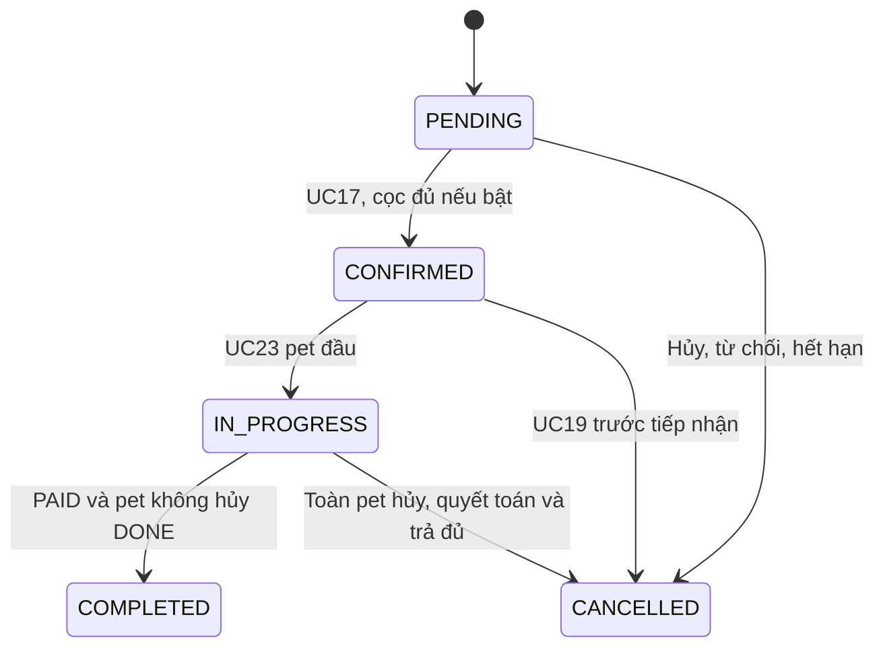
```mermaid
stateDiagram-v2
    [*] --> PENDING
    PENDING --> CONFIRMED: UC17, cọc đủ nếu bật
    PENDING --> CANCELLED: Hủy, từ chối, hết hạn
    CONFIRMED --> IN_PROGRESS: UC23 pet đầu
    CONFIRMED --> CANCELLED: UC19 trước tiếp nhận
    IN_PROGRESS --> COMPLETED: PAID và pet không hủy DONE
    IN_PROGRESS --> CANCELLED: Toàn pet hủy, quyết toán và trả đủ
```

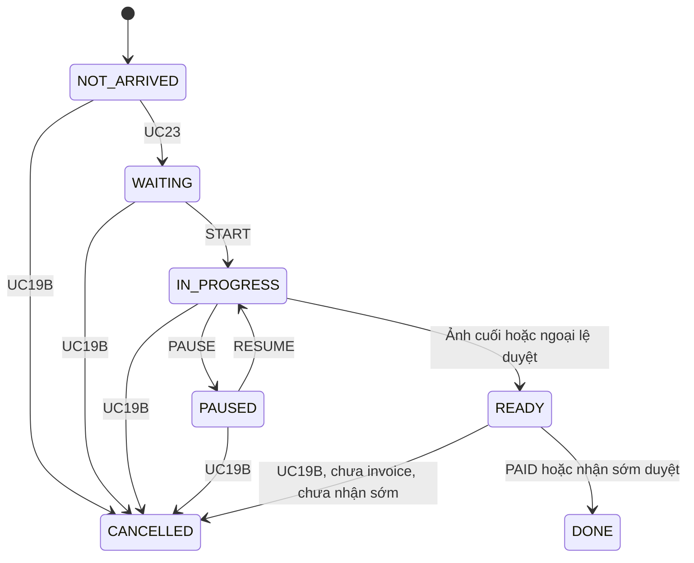
```mermaid
stateDiagram-v2
    [*] --> NOT_ARRIVED
    NOT_ARRIVED --> WAITING: UC23
    NOT_ARRIVED --> CANCELLED: UC19B
    WAITING --> IN_PROGRESS: START
    WAITING --> CANCELLED: UC19B
    IN_PROGRESS --> PAUSED: PAUSE
    PAUSED --> IN_PROGRESS: RESUME
    IN_PROGRESS --> READY: Ảnh cuối hoặc ngoại lệ duyệt
    IN_PROGRESS --> CANCELLED: UC19B
    PAUSED --> CANCELLED: UC19B
    READY --> DONE: PAID hoặc nhận sớm duyệt
    READY --> CANCELLED: UC19B, chưa invoice, chưa nhận sớm
```

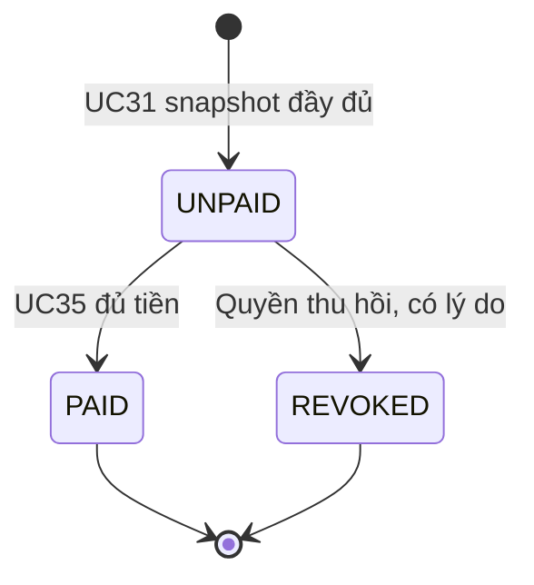
```mermaid
stateDiagram-v2
    [*] --> UNPAID: UC31 snapshot đầy đủ
    UNPAID --> PAID: UC35 đủ tiền
    UNPAID --> REVOKED: Quyền thu hồi, có lý do
    PAID --> [*]
    REVOKED --> [*]
```

## 7. DFD và các sơ đồ hoạt động

Các hình nhánh ghi actor tại điểm đầu, điều kiện dưới transaction và kết quả khi lỗi. DB rollback về state đầu của transaction; tác động ngoài DB như tiền đã chuyển cần đối soát/bù, không giả vờ rollback.

### 7.1 DFD xuyên suốt

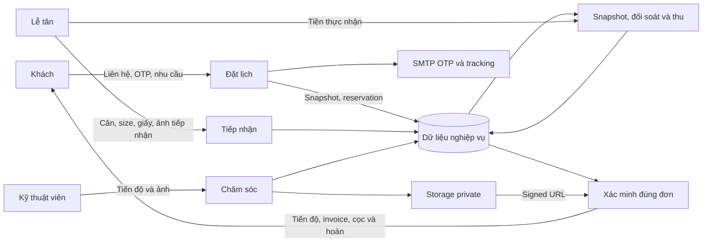
```mermaid
flowchart LR
    Khach["Khách"] -->|Liên hệ, OTP, nhu cầu| Booking["Đặt lịch"]
    Booking -->|Snapshot, reservation| DB[("Dữ liệu nghiệp vụ")]
    Booking --> Mail["SMTP OTP và tracking"]
    Quay["Lễ tân"] -->|Cân, size, giấy, ảnh tiếp nhận| Checkin["Tiếp nhận"]
    Checkin --> DB
    Tech["Kỹ thuật viên"] -->|Tiến độ và ảnh| Care["Chăm sóc"]
    Care --> DB
    Care --> Storage["Storage private"]
    DB --> Bill["Snapshot, đối soát và thu"]
    Quay -->|Tiền thực nhận| Bill
    Bill --> DB
    DB --> Tracking["Xác minh đúng đơn"]
    Storage -->|Signed URL| Tracking
    Tracking -->|Tiến độ, invoice, cọc và hoàn| Khach
```

### 7.2 Luồng chính

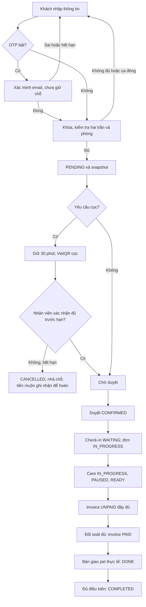
```mermaid
flowchart TD
    A["Khách nhập thông tin"] --> B{"OTP bật?"}
    B -->|Có| C["Xác minh email, chưa giữ chỗ"]
    C -->|Sai hoặc hết hạn| A
    C -->|Đúng| D["Khóa, kiểm tra hai trần và phòng"]
    B -->|Không| D
    D -->|Không đủ hoặc ca đóng| A
    D -->|Đủ| E["PENDING và snapshot"]
    E --> F{"Yêu cầu cọc?"}
    F -->|Có| G["Giữ 30 phút; VietQR cọc"]
    G --> H{"Nhân viên xác nhận đủ trước hạn?"}
    H -->|Không, hết hạn| X["CANCELLED, nhả chỗ; tiền muộn ghi nhận để hoàn"]
    H -->|Có| I["Chờ duyệt"]
    F -->|Không| I
    I --> J["Duyệt CONFIRMED"]
    J --> K["Check-in WAITING; đơn IN_PROGRESS"]
    K --> L["Care IN_PROGRESS, PAUSED, READY"]
    L --> M["Invoice UNPAID đầy đủ"]
    M --> N["Đối soát đủ: invoice PAID"]
    N --> O["Bàn giao pet thực tế: DONE"]
    O --> P["Đủ điều kiện: COMPLETED"]
```

### 7.3 Nhận sớm

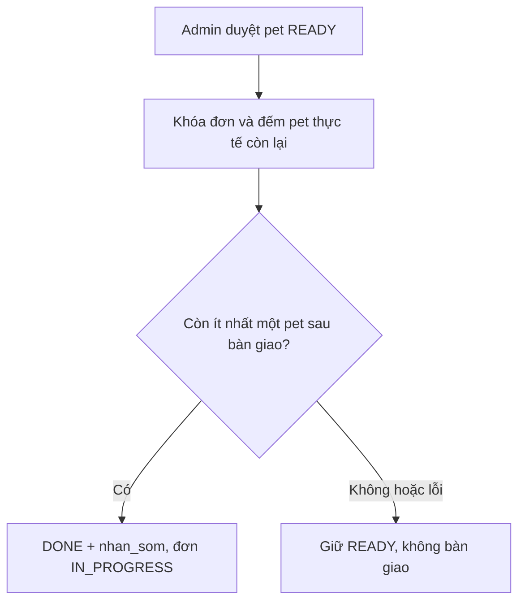
```mermaid
flowchart TD
    A["Admin duyệt pet READY"] --> B["Khóa đơn và đếm pet thực tế còn lại"]
    B --> C{"Còn ít nhất một pet sau bàn giao?"}
    C -->|Có| D["DONE + nhan_som, đơn IN_PROGRESS"]
    C -->|Không hoặc lỗi| E["Giữ READY, không bàn giao"]
```

### 7.4 Hủy riêng

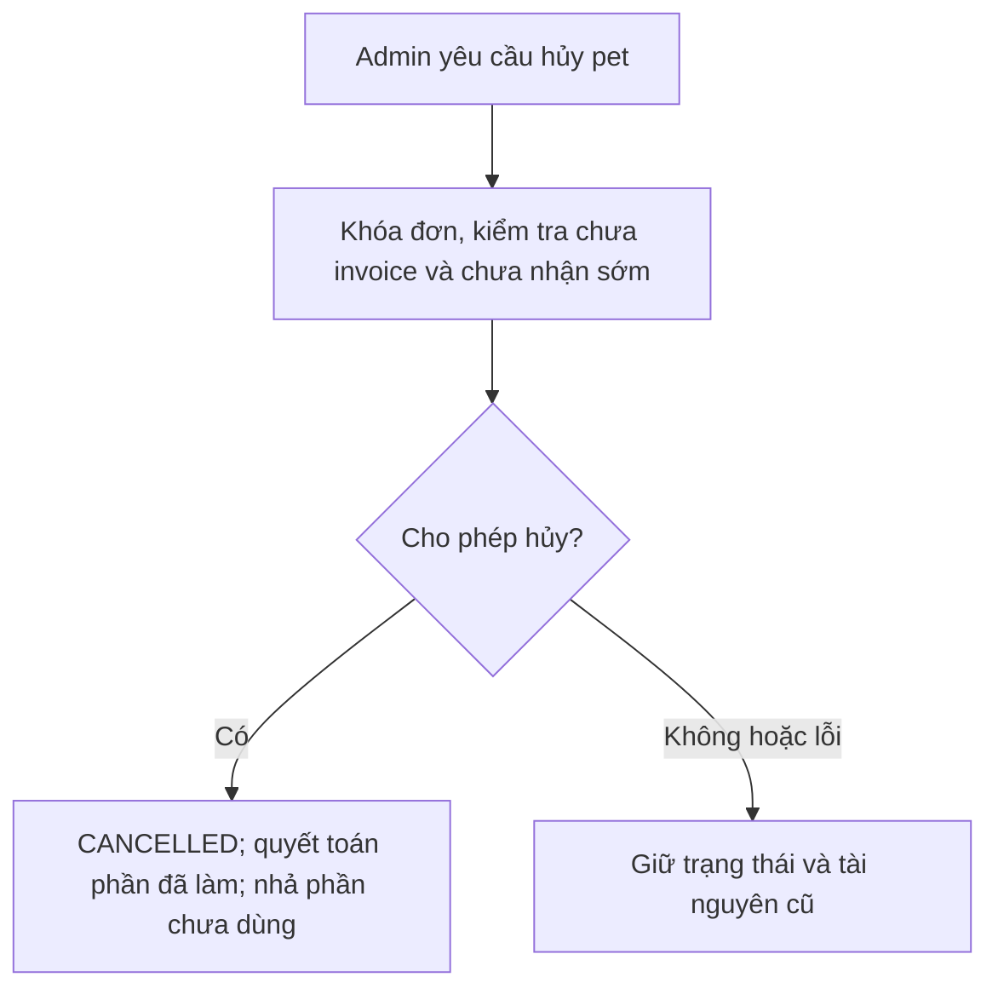
```mermaid
flowchart TD
    A["Admin yêu cầu hủy pet"] --> B["Khóa đơn, kiểm tra chưa invoice và chưa nhận sớm"]
    B --> C{"Cho phép hủy?"}
    C -->|Có| D["CANCELLED; quyết toán phần đã làm; nhả phần chưa dùng"]
    C -->|Không hoặc lỗi| E["Giữ trạng thái và tài nguyên cũ"]
```

### 7.5 Không quay lại sau nhận sớm

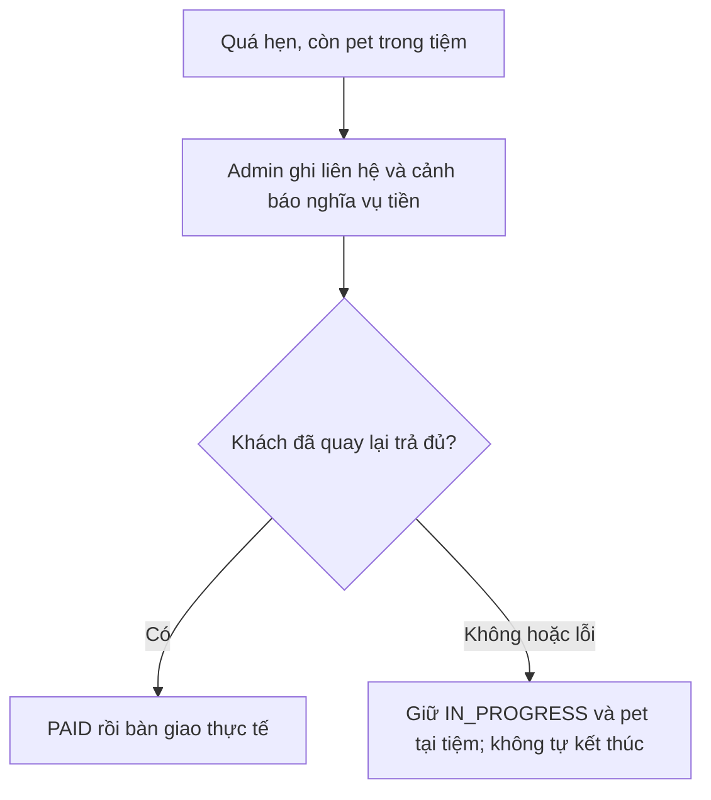
```mermaid
flowchart TD
    A["Quá hẹn, còn pet trong tiệm"] --> B["Admin ghi liên hệ và cảnh báo nghĩa vụ tiền"]
    B --> C{"Khách đã quay lại trả đủ?"}
    C -->|Có| D["PAID rồi bàn giao thực tế"]
    C -->|Không hoặc lỗi| E["Giữ IN_PROGRESS và pet tại tiệm; không tự kết thúc"]
```

### 7.6 Chuyển sai tiền

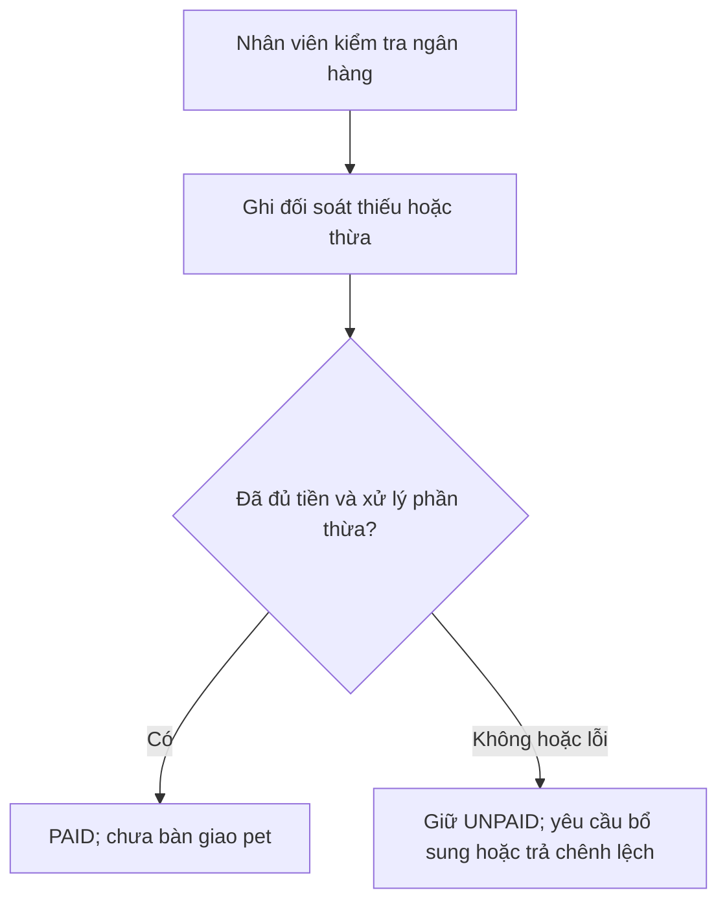
```mermaid
flowchart TD
    A["Nhân viên kiểm tra ngân hàng"] --> B["Ghi đối soát thiếu hoặc thừa"]
    B --> C{"Đã đủ tiền và xử lý phần thừa?"}
    C -->|Có| D["PAID; chưa bàn giao pet"]
    C -->|Không hoặc lỗi| E["Giữ UNPAID; yêu cầu bổ sung hoặc trả chênh lệch"]
```

### 7.7 Phụ phí sau PAID

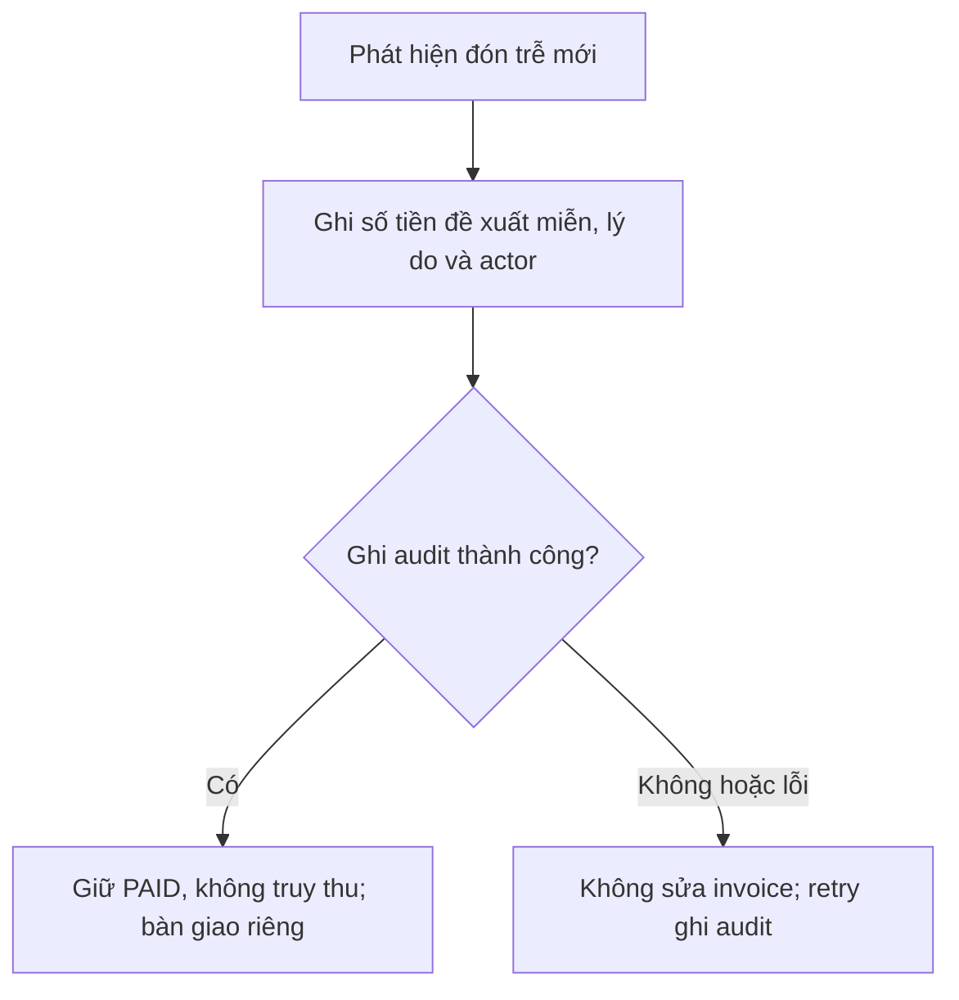
```mermaid
flowchart TD
    A["Phát hiện đón trễ mới"] --> B["Ghi số tiền đề xuất miễn, lý do và actor"]
    B --> C{"Ghi audit thành công?"}
    C -->|Có| D["Giữ PAID, không truy thu; bàn giao riêng"]
    C -->|Không hoặc lỗi| E["Không sửa invoice; retry ghi audit"]
```

### 7.8 Thu hồi và tạo lại

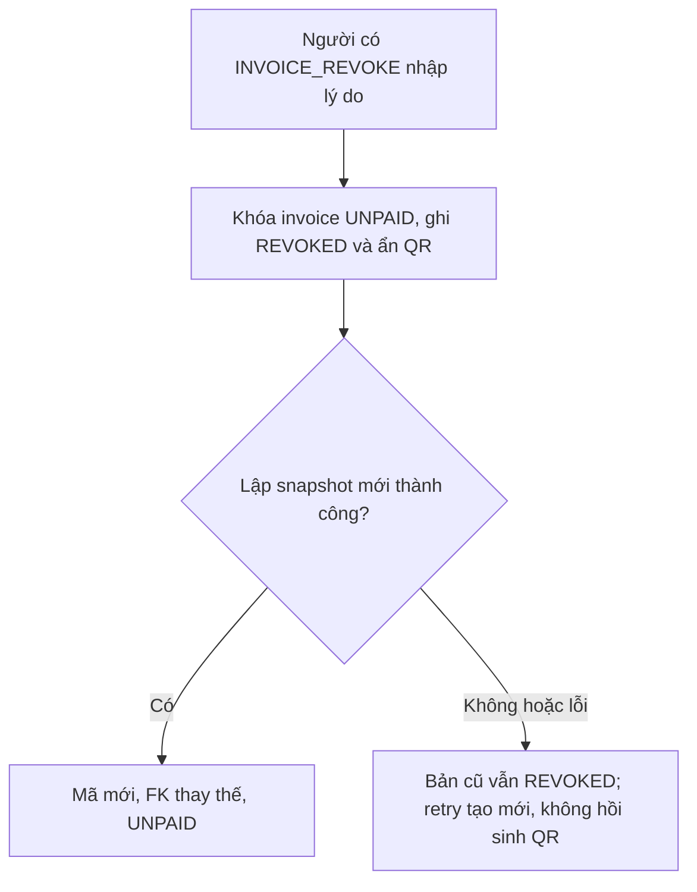
```mermaid
flowchart TD
    A["Người có INVOICE_REVOKE nhập lý do"] --> B["Khóa invoice UNPAID, ghi REVOKED và ẩn QR"]
    B --> C{"Lập snapshot mới thành công?"}
    C -->|Có| D["Mã mới, FK thay thế, UNPAID"]
    C -->|Không hoặc lỗi| E["Bản cũ vẫn REVOKED; retry tạo mới, không hồi sinh QR"]
```

### 7.9 Hoàn cọc

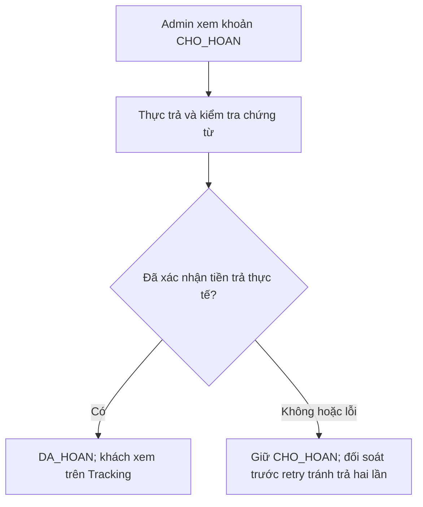
```mermaid
flowchart TD
    A["Admin xem khoản CHO_HOAN"] --> B["Thực trả và kiểm tra chứng từ"]
    B --> C{"Đã xác nhận tiền trả thực tế?"}
    C -->|Có| D["DA_HOAN; khách xem trên Tracking"]
    C -->|Không hoặc lỗi| E["Giữ CHO_HOAN; đối soát trước retry tránh trả hai lần"]
```

### 7.10 No-show

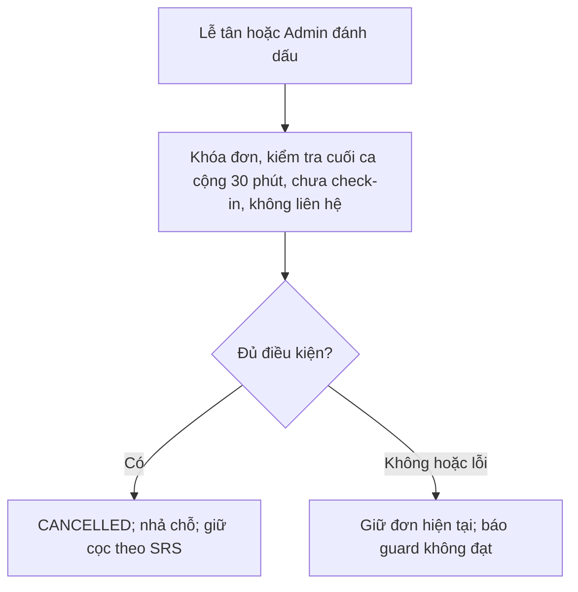
```mermaid
flowchart TD
    A["Lễ tân hoặc Admin đánh dấu"] --> B["Khóa đơn, kiểm tra cuối ca cộng 30 phút, chưa check-in, không liên hệ"]
    B --> C{"Đủ điều kiện?"}
    C -->|Có| D["CANCELLED; nhả chỗ; giữ cọc theo SRS"]
    C -->|Không hoặc lỗi| E["Giữ đơn hiện tại; báo guard không đạt"]
```

### 7.11 Dời lịch

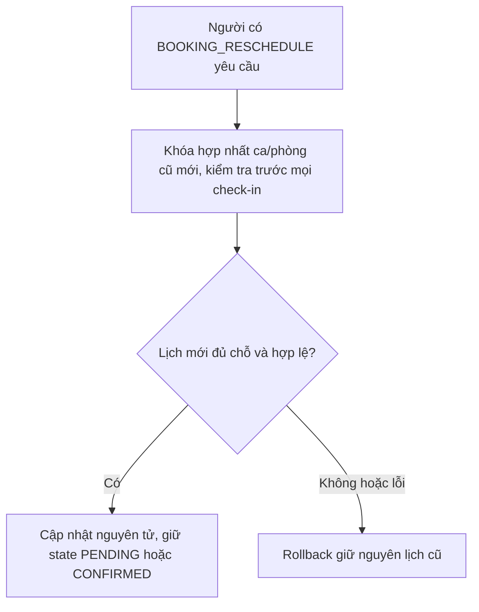
```mermaid
flowchart TD
    A["Người có BOOKING_RESCHEDULE yêu cầu"] --> B["Khóa hợp nhất ca/phòng cũ mới, kiểm tra trước mọi check-in"]
    B --> C{"Lịch mới đủ chỗ và hợp lệ?"}
    C -->|Có| D["Cập nhật nguyên tử, giữ state PENDING hoặc CONFIRMED"]
    C -->|Không hoặc lỗi| E["Rollback giữ nguyên lịch cũ"]
```

### 7.12 Ngày nghỉ và ca không nhân viên

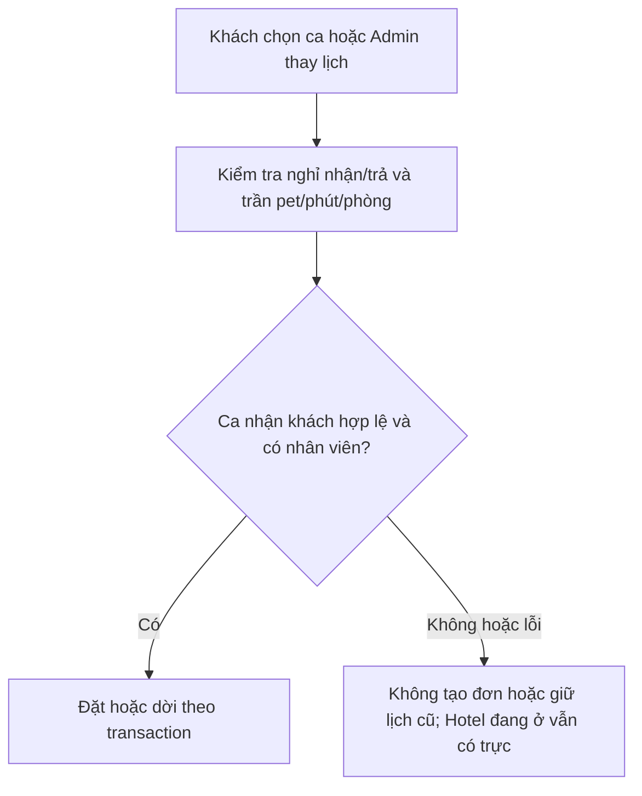
```mermaid
flowchart TD
    A["Khách chọn ca hoặc Admin thay lịch"] --> B["Kiểm tra nghỉ nhận/trả và trần pet/phút/phòng"]
    B --> C{"Ca nhận khách hợp lệ và có nhân viên?"}
    C -->|Có| D["Đặt hoặc dời theo transaction"]
    C -->|Không hoặc lỗi| E["Không tạo đơn hoặc giữ lịch cũ; Hotel đang ở vẫn có trực"]
```

## 8. Extension và vận hành

OTP email: đề xuất 6 chữ số, 5 phút, tối đa 5 lần thử, gửi lại >=60 giây; digest với secret server, không mã rõ. Proof ngẫu nhiên có TTL, chỉ lưu digest, gắn scope/contact/request, dùng một lần khi commit booking; retry cùng requestId đọc kết quả cũ. OTP gửi email mới chỉ xác minh email đó; EXISTING_PETS gửi email master đúng hồ sơ. Nếu cặp liên hệ trùng nhiều hồ sơ không thể xác định an toàn thì trả thông báo chung và hướng dẫn quầy, không trả danh sách master để chọn.

Ba cờ Extension độc lập nhưng cọc bắt buộc đi cùng giữ chỗ 30 phút; không cho cấu hình cọc bật mà giữ chỗ tắt. OTP có thể tắt, khi đó Public không được chọn pet cũ. Booking snapshot cờ và phiên bản chính sách, không đổi giữa chừng do global config.

Hủy toàn đơn trước >=2h hoặc quầy từ chối: hoàn cọc theo SRS; hủy muộn/no-show: giữ cọc. Ghi tiền giữ hợp lệ và lý do trong snapshot quyết toán/audit, không coi giao dịch nhận mới. Mọi tiền nhận do đơn hết hạn phải hoàn, không phạt no-show nhầm cho đơn hết hạn cọc.

Tracking hợp lệ đọc được đơn ở mọi state để xem invoice/hoàn. Gửi lại tự phục vụ theo D19 chỉ đơn chưa kết thúc, nhập SĐT+email snapshot (ngày hẹn tùy chọn); mất mã đơn đã hủy thì quầy xác minh hỗ trợ, chưa tự mở thêm phạm vi D19. Mã không đổi, không trả mã hoặc list booking qua Public response. Mở khóa Admin có audit. Theo checklist 2.6 mới nhất của nhóm trưởng, khóa ngay lần sai thứ 5 trong cửa sổ 15 phút, khóa 15 phút rồi reset; quy tắc mới thay chữ “quá 5 lần” của baseline UC15.

Storage private; đề xuất JPEG/PNG/WebP <=5MiB/file, <=10file/request, kiểm tra signature và decode thật; server sinh object path, không nhận URL tùy ý. Signed URL đề xuất 5 phút, không persist URL; Tracking chỉ ảnh đúng đơn, không thông tin nội bộ. OTP/tracking/login có rate limit; không log secret/pair nhạy cảm.

Thông báo gửi sau commit: booking, duyệt, thay chính sách đơn cũ, tracking, hoàn cọc, review 1–2 sao tới Admin. Timeout hữu hạn, lỗi có trạng thái; không cam kết exactly-once SMTP hoặc dùng email thay bằng chứng đã thu/hoàn.

**NFR đã duyệt (M2-14):** ngưỡng <500ms áp dụng phần xử lý API/DB sau khi đã nhận đủ request; đo riêng thời gian truyền file và gửi SMTP. Phần validation, kiểm tra quyền, tính nghiệp vụ, truy vấn/transaction DB và tạo response thuộc phép đo API/DB. Không dùng tổng thời gian phản hồi gồm SMTP làm kết quả của chỉ số này, cũng không gọi chỉ số API/DB là độ trễ end-to-end. Báo cáo riêng thời gian upload, SMTP và tổng request. Giữ emailDelivery SENT/FAILED; không tự đổi sang QUEUED. Chỉ tiêu đã chốt không phải bằng chứng đạt chỉ tiêu; kiểm chứng tải/latency ở implementation.

## 9. Traceability và cửa duyệt M2

[API contract](api-contract.md) sở hữu từng operation/DTO/status. [Traceability](requirements-traceability.md) nối UC/quy tắc/bảng/kiểm chứng. Không dùng tên service mock làm tên HTTP bắt buộc.

| Câu hỏi nghiệm thu | Câu trả lời trong thiết kế |
|---|---|
| Multi-pet/multi-service tính tiền thế nào? | Một pet/lượt, nhiều dịch vụ; mỗi invoice line có pet, size, nguồn, snapshot; combo không cộng trùng thành phần. |
| Chốt giá lúc nào? | Bảng cam kết lúc đặt; cân/size/giá đồng thuận lúc check-in; invoice chụp kết quả; nhánh thu gọn hoặc hủy có dấu vết. |
| Cọc 30% trên phần nào? | Phòng + Spa/Combo ban đầu toàn đơn; không phát sinh sau này; hoàn/giữ theo chính sách và đối soát thực nhận. |
| Ca còn nhận khi nào? | Đồng thời pet và phút, nhân viên APPROVED đủ điều kiện; Hotel kiểm tra từng đêm dưới khóa loại phòng. |
| Giấy tiêm và đổi cấu hình? | Snapshot chính sách, staff xác minh đúng pet và hiệu lực ngày tiếp nhận; Admin đổi đơn cũ riêng có lý do/thông báo. |
| Mất tracking/khóa sai? | Gửi email snapshot thông báo chung, quầy hỗ trợ; tự mở 15 phút hoặc Admin mở; khóa từ lần sai thứ 5 theo checklist mới nhất. |

**Kết quả cửa duyệt:** nhóm trưởng đã phê duyệt cả sáu tài liệu theo M2-15; baseline thiết kế và API được khóa. NFR theo M2-14, tracking khóa từ lần sai thứ 5. Các thông số từng ghi “đề xuất” trong gói trở thành mặc định ban đầu đã duyệt. Thay đổi nội dung contract/schema/state sau mốc này phải được ghi nhận và duyệt như thay đổi baseline; không tự đổi khi sinh code. Phê duyệt này không phải yêu cầu bắt đầu viết code M3.

**Giới hạn kiểm chứng:** đã kiểm tra cấu trúc tài liệu và tham chiếu chéo; 19 khối Mermaid chưa được render. Nhóm trưởng chấp nhận gói tài liệu hiện tại với giới hạn này. Render là việc xác minh trình bày còn lại; nếu phát hiện lỗi nội dung cần sửa baseline có kiểm soát. Ở implementation phải kiểm chứng M2-L01–09, xUnit WebApplicationFactory, concurrency PostgreSQL và latency thực tế. Tài liệu đã duyệt không chứng minh locking/API/hiệu năng đã chạy đúng.
